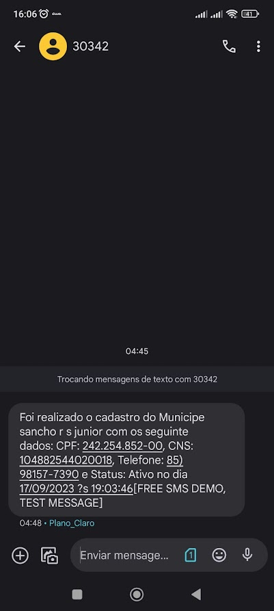
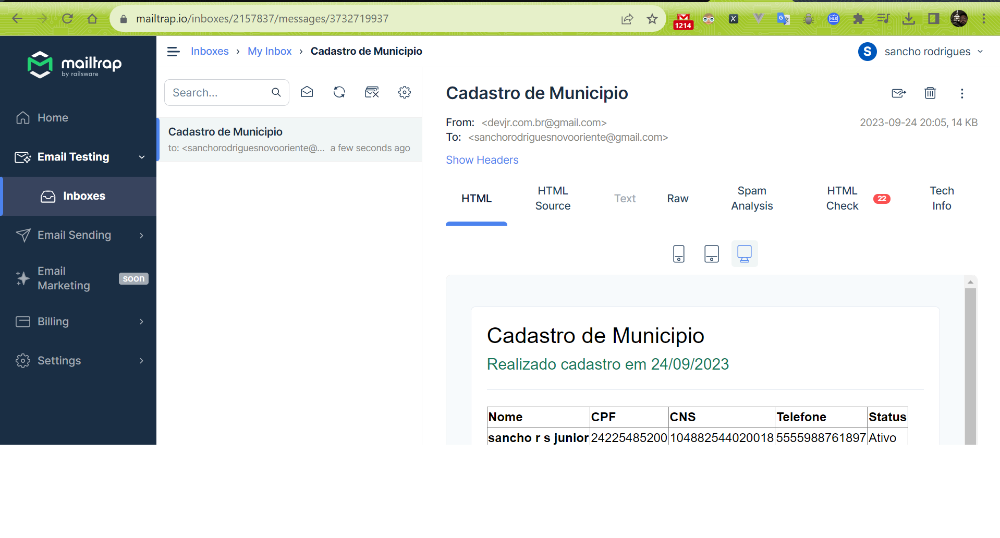

# CHALLENGE_OMTHIRTY

# Montando ambiente local via ASDF
[Ambiente Local via ASDF](README_ENVIROMENT_LOCAL.md)
# Usando Docker Compose
docker compose up

# Mensagem de SMS enviada

# Email enviado

# Vídeo de demonstração do sistema

https://www.loom.com/share/568bababd41e4b55adb95753737691e2?sid=20ee8c54-7390-48d3-b6b8-e56a636a7d0a